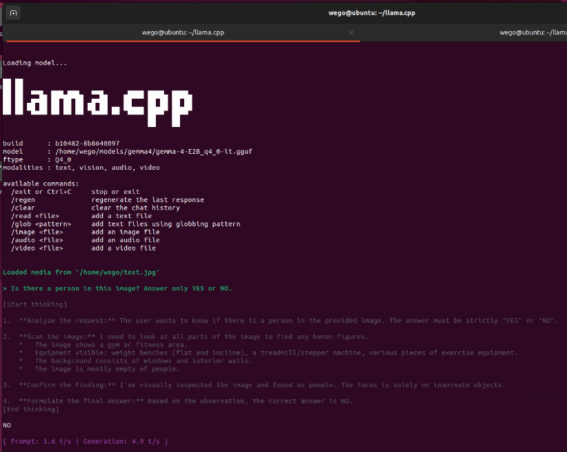
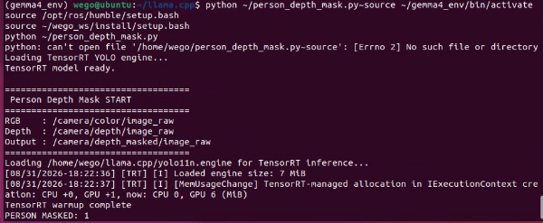
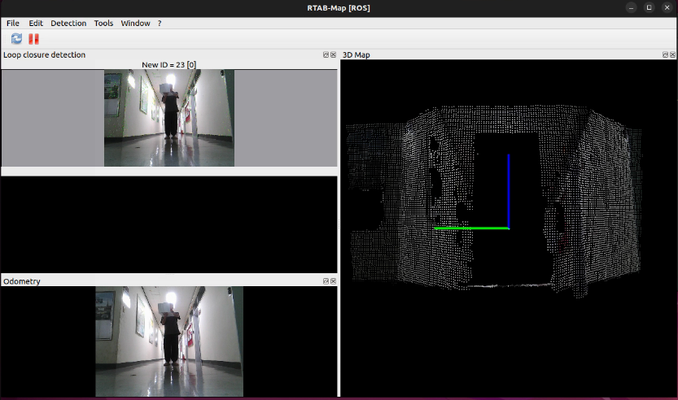

# LIMO Pro Gemma 4-based Intelligent Mobile Robot

**Gemma 4 E2B · YOLO11 · TensorRT · RGB-D Person Following · Dynamic Object-Aware SLAM**

LIMO Pro mobile robot project integrating multimodal AI, real-time person perception,
RGB-D based person following, and dynamic-object-aware RTAB-Map SLAM.

## 1. Project Overview

본 프로젝트에서는 LIMO Pro 모바일 로봇에 Gemma 4 E2B,
YOLO11, TensorRT 및 RGB-D Camera를 통합하여
사람 인식·추종과 동적 객체를 고려한 SLAM 시스템을 구현하였다.

실시간 사람 인식은 YOLO11을 이용하여 수행하고,
TensorRT FP16 기반으로 추론을 가속하여 모바일 로봇에서
실시간으로 동작할 수 있도록 구성하였다.

검출된 사람의 영상 내 위치와 RGB-D Camera의 Depth 정보를 결합하여
사람과의 거리 및 방향을 추정하고, 이를 ROS 2 `/cmd_vel` 명령으로 변환하여
LIMO Pro가 사람을 따라가는 Person Following 기능을 구현하였다.

또한 검출된 사람 영역의 Depth 정보를 제거한 Masked Depth Image를 생성하고,
이를 RTAB-Map의 입력으로 사용하여 이동하는 사람이 지도에 정적 장애물로
누적되는 영향을 줄이는 Dynamic Object-Aware SLAM 파이프라인을 구성하였다.

Gemma 4 E2B는 실시간 제어를 직접 수행하는 대신,
자연어 명령 해석 및 상황 판단과 같은 상위 수준의
로봇 의사결정 모듈로 활용하는 구조를 설계하였다.

## 2. Project Objectives

본 프로젝트의 주요 목표는 다음과 같다.

- Jetson 환경에서 Gemma 4 E2B 멀티모달 모델 구동
- ROS 2 RGB-D Camera와 AI perception pipeline 연동
- YOLO11 기반 실시간 사람 검출
- TensorRT FP16을 이용한 inference acceleration
- RGB-D Depth 기반 사람 거리 및 방향 추정
- `/cmd_vel` 기반 LIMO Pro Person Following 구현
- 사람 영역의 Depth 정보를 제거하는 Dynamic Object Masking 구현
- Masked Depth와 RTAB-Map을 연동한 Dynamic Object-Aware SLAM 구성

## 3. System Architecture

본 시스템은 실시간 인지 및 제어 계층과
상위 수준 AI 판단 계층으로 구성하였다.

### Real-Time Perception & Control

RGB-D Camera  
→ YOLO11 + TensorRT Person Detection  
→ Person Position / Depth Estimation  
→ Person Following Controller  
→ `/cmd_vel`  
→ LIMO Pro

### Dynamic Object-Aware SLAM

RGB-D Camera  
→ Person Detection  
→ Person Depth Masking  
→ `/camera/depth_masked/image_raw`  
→ RTAB-Map  
→ 3D Map / Occupancy Grid

### AI

RGB Camera / Robot State  
→ Gemma 4 E2B  
→ Natural Language Understanding / High-Level Decision  
→ Robot Behavior

실시간성이 요구되는 사람 검출 및 추종은 YOLO11과 TensorRT가 담당하고,
Gemma 4 E2B는 자연어 명령 해석과 상황 판단 등 상대적으로
낮은 주기의 상위 수준 의사결정을 담당하도록 역할을 분리하였다.

이를 통해 대규모 멀티모달 모델이 매 프레임의 저수준 제어를 직접 수행하지 않으면서도,
실시간 perception pipeline과 AI 판단을 하나의 모바일 로봇 시스템에
통합할 수 있도록 설계하였다.

## 4. Hardware & Software

| Category | Hardware / Software | Role |
|---|---|---|
| Mobile Robot | LIMO Pro | Mobile robot platform |
| Computing Platform | NVIDIA Jetson Orin | On-board AI inference and ROS 2 processing |
| RGB-D Camera | Orbbec RGB-D Camera | RGB image and depth acquisition |
| OS | Ubuntu 22.04 | Development environment |
| Middleware | ROS 2 Humble | Robot communication and system integration |
| Vision-Language Model | Gemma 4 E2B | Vision inference and high-level decision making |
| LLM Runtime | llama.cpp | Gemma 4 local inference |
| Object Detection | YOLO11n | Real-time person detection |
| Inference Acceleration | TensorRT FP16 | YOLO11 inference acceleration |
| SLAM | RTAB-Map | RGB-D based mapping |
| Navigation | Nav2 | Navigation framework |
| Computer Vision | OpenCV | Image processing |
| Programming | Python | ROS 2 nodes and perception pipeline implementation |

## 5. Gemma 4 E2B Integration

LIMO Pro의 Jetson 환경에서 멀티모달 모델을 직접 구동하기 위해
Gemma 4 E2B의 GGUF 모델과 llama.cpp 기반 로컬 inference 환경을 구성하였다.

llama.cpp를 CUDA 환경에서 빌드하고 Gemma 4 E2B Q4_0 모델과
multimodal projector를 적용하여 Text뿐만 아니라 Image 입력을 처리할 수 있도록 구성하였다.

실제 Camera Image를 Gemma 4에 입력하여 이미지 내 상황을 분석하는
Vision inference를 수행하였으며, 이를 통해 로봇의 시각 정보를
상위 수준의 상황 판단에 활용할 수 있는 환경을 구축하였다.

실시간 사람 검출 및 로봇 제어는 YOLO11과 TensorRT 기반 perception pipeline이 담당하고,
Gemma 4는 자연어 명령 해석 및 상황 판단과 같은 high-level intelligence를
담당하도록 역할을 분리하였다.

  

  <em>Gemma 4 E2B multimodal vision inference on the LIMO Pro Jetson platform</em>

## 6. YOLO11 + TensorRT Person Detection

실시간 Person Following을 위해 YOLO11n을 이용하여
RGB Camera 영상에서 사람을 검출하였다.

초기 PyTorch 기반 YOLO11n에서는 실제 ROS 2 Camera 입력 처리 시
약 700–900 ms의 inference latency가 발생하여
실시간 로봇 제어에 한계가 있었다.

이를 개선하기 위해 YOLO11n 모델을 TensorRT FP16 Engine으로 변환하고,
Jetson GPU 기반 inference pipeline을 구성하였다.

### Inference Performance

| Method | Inference Latency | Processing Rate |
|---|---:|---:|
| PyTorch CPU | 700–900 ms | 1.1–1.4 FPS |
| TensorRT FP16 | 10–17 ms | 60–100 FPS |

TensorRT 적용을 통해 inference latency를 크게 감소시켰으며,
실제 RGB Camera 입력 속도에 맞춰 실시간 Person Detection이 가능하도록 개선하였다.

## 7. RGB-D Person Following

YOLO11을 통해 검출된 사람의 영상 내 위치와
RGB-D Camera의 Depth 정보를 결합하여 대상의 방향과 거리를 추정하였다.

사람의 Bounding Box 중심과 영상 중심 사이의 오차를 이용하여
좌우 방향을 판단하고, Depth 정보를 이용하여 로봇과 사람 사이의 거리를 계산하였다.

계산된 방향 및 거리 오차를 기반으로
ROS 2 `geometry_msgs/msg/Twist`의 `angular.z`와 `linear.x`를 생성하고,
`/cmd_vel`을 통해 LIMO Pro를 제어하였다.

### Control Pipeline

`Person Detection` → `RGB-D Distance Estimation` → `Direction & Distance Error` → `Velocity Command` → `/cmd_vel` → `LIMO Pro`

목표 거리는 **1.0 m**로 설정하였으며,
TensorRT 기반 실시간 Person Detection과 30 Hz 제어 주기를 적용하여
사람의 이동에 따라 LIMO Pro가 연속적으로 추종하도록 구성하였다.

### Person Following Demo

실제 실내 환경에서 사용자가 이동함에 따라 LIMO Pro가
대상의 방향과 거리를 추정하며 주행하는 모습을 확인하였다.

▶️ **Person Following Demo Video**

https://github.com/user-attachments/assets/cfd98685-cb34-494b-a372-c80bf2875553

## 8. Dynamic Object-Aware SLAM

일반적인 RGB-D SLAM에서는 사람과 같은 동적 객체의 Depth 정보가
Point Cloud 및 지도 생성 과정에 포함되어 Mapping 결과에 영향을 줄 수 있다.

이를 줄이기 위해 RGB 영상에서 검출된 사람 영역의 Depth 값을 제거하고,
마스킹된 Depth 영상을 RTAB-Map의 입력으로 사용하는
Dynamic Object-Aware SLAM 파이프라인을 구성하였다.

### Person Depth Masking & RTAB-Map Integration

RGB 영상에서 사람을 검출한 뒤 해당 영역에 대응되는 Depth 값을 제거하고,
마스킹된 Depth 영상을 `/camera/depth_masked/image_raw` 토픽으로 발행하였다.

RTAB-Map은 기존 `/camera/depth/image_raw` 대신 마스킹된 Depth 토픽을 입력으로 사용하여
사람과 같은 동적 객체의 Depth 정보가 3D Mapping에 반영되는 영향을 줄이도록 구성하였다.

### Processing Pipeline

`RGB-D Camera` → `Person Detection` → `Depth Masking` → `/camera/depth_masked/image_raw` → `RTAB-Map` → `3D Map`

<table>
  <tr>
    <td align="center" width="50%">
       
      <b>Person Depth Masking Node</b>
    </td>
    <td align="center" width="50%">
       
      <b>RTAB-Map with Masked Depth Input</b>
    </td>
  </tr>
</table>

## 9. Implementation Results

본 프로젝트를 통해 LIMO Pro의 Jetson 환경에서
멀티모달 AI 모델, 실시간 객체 인식, RGB-D 기반 로봇 제어 및
SLAM을 하나의 ROS 2 기반 시스템으로 통합하였다.

### Implemented Features

| Module | Result |
|---|---|
| Gemma 4 E2B | Jetson 기반 Text / Vision inference 구현 |
| YOLO11n | RGB Camera 기반 Person Detection 구현 |
| TensorRT FP16 | YOLO11n 실시간 inference acceleration |
| RGB-D Perception | 사람의 방향 및 거리 추정 |
| Person Following | `/cmd_vel` 기반 LIMO Pro 실시간 사람 추종 |
| Depth Masking | 사람 영역의 Depth 정보 제거 |
| RTAB-Map | Masked Depth 기반 RGB-D 3D Mapping |

### Key Results

- YOLO11n의 ROS Camera inference latency를 **약 700–900 ms에서 10–17 ms** 수준으로 단축
- TensorRT 기반 실시간 Person Detection 및 **30 Hz 로봇 제어** 구성
- RGB-D Depth를 이용한 **1.0 m 목표 거리 기반 Person Following** 구현
- 사람 영역을 제거한 `/camera/depth_masked/image_raw` 생성
- Masked Depth를 RTAB-Map에 직접 입력하는 Dynamic Object-Aware SLAM pipeline 구성
- Gemma 4 E2B를 Jetson에서 구동하여 실제 Image 기반 Vision inference 확인

- ## 10. Challenges & Troubleshooting

프로젝트를 진행하면서 실시간 AI inference, 제한된 computing resource,
sensor configuration 및 SLAM parameter와 관련된 여러 문제를 확인하고 개선하였다.

| Challenge | Cause / Analysis | Solution / Result |
|---|---|---|
| Slow YOLO Inference | PyTorch CPU 기반 inference에서 약 700–900 ms의 latency 발생 | YOLO11n을 TensorRT FP16 Engine으로 변환하여 약 10–17 ms 수준으로 단축 |
| Unstable Person Following | 낮은 detection rate로 인해 오래된 detection 결과를 기반으로 제어 | TensorRT 적용 및 30 Hz control loop를 구성하여 연속적인 robot control 구현 |
| Gemma 4 + TensorRT Memory Limitation | Jetson의 unified memory 환경에서 Gemma 4와 TensorRT 동시 실행 시 memory 부족 발생 | llama-server의 memory usage와 TensorRT GPU allocation을 확인하여 OOM 원인 분석 |
| RGB-D Camera TF Mismatch | 실제 Camera가 약 12.5° 위쪽을 향하고 있었으나 TF와 실제 장착 각도 불일치 | Camera pitch를 TF에 반영하여 실제 sensor orientation과 coordinate frame을 보정 |
| RTAB-Map Grid Artifacts | 실내 Mapping 과정에서 Occupancy Grid에 반복적인 stripe artifact 발생 | Camera TF 및 RTAB-Map Grid parameter를 변경하며 원인 분석 |

## 11. Future Work

현재 시스템에서는 YOLO11 + TensorRT 기반의 실시간 perception 및
Person Following과 Dynamic Object-Aware SLAM을 구현하였으며,
Gemma 4 E2B의 multimodal inference 환경을 구성하였다.

향후에는 각 모듈을 하나의 통합된 intelligent mobile robot system으로 확장하고자 한다.

- Gemma 4 E2B와 TensorRT perception pipeline의 동시 실행을 위한 memory optimization
- 자연어 명령을 이용한 `FOLLOW`, `STOP`, `GO_TO` 등의 high-level behavior control
- Gemma 4의 visual understanding과 robot state를 결합한 situation-aware decision making
- RTAB-Map 및 Nav2와 high-level AI decision module 연동
- Person target loss 및 re-identification 처리 개선
- 위치 및 장소 정보를 활용한 semantic memory 구성
- Dynamic Object Masking 적용 전/후 SLAM 성능의 정량적 비교
